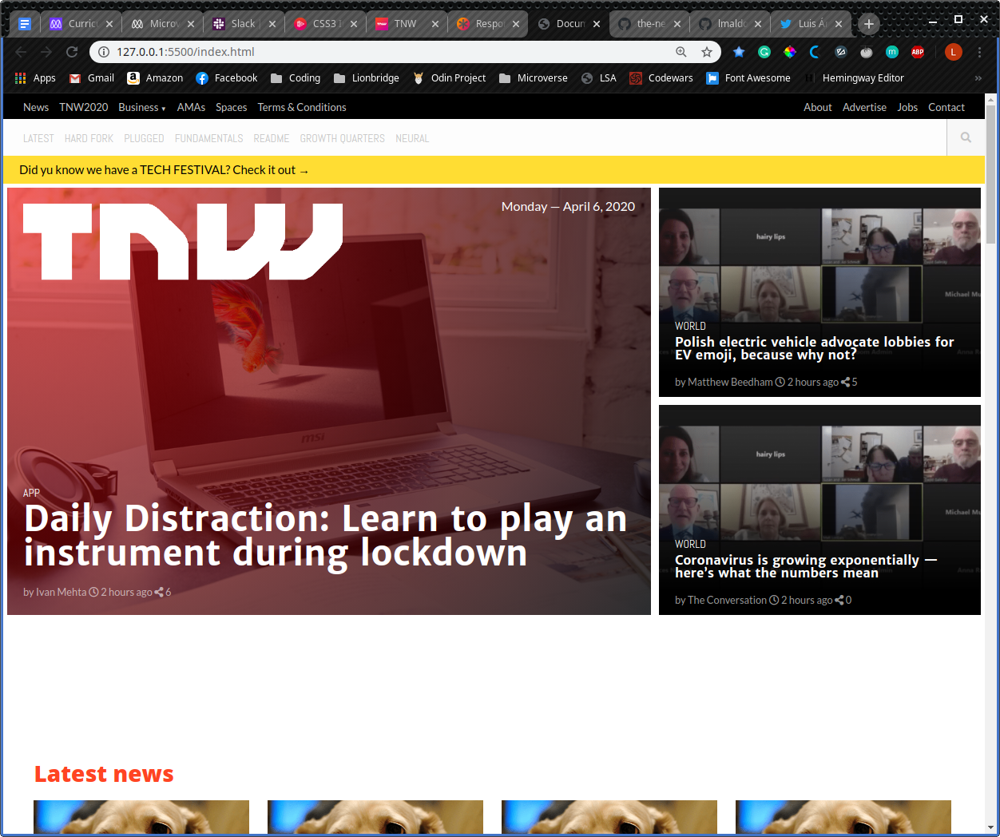
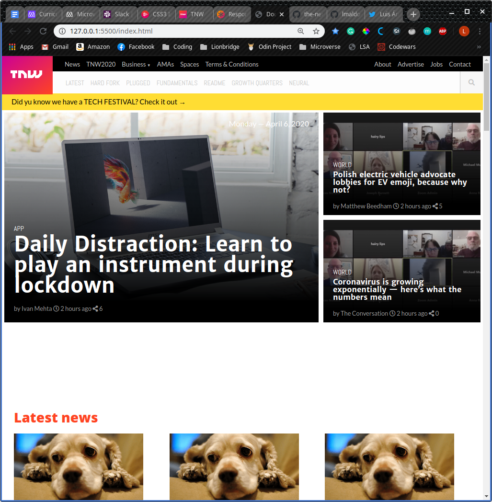
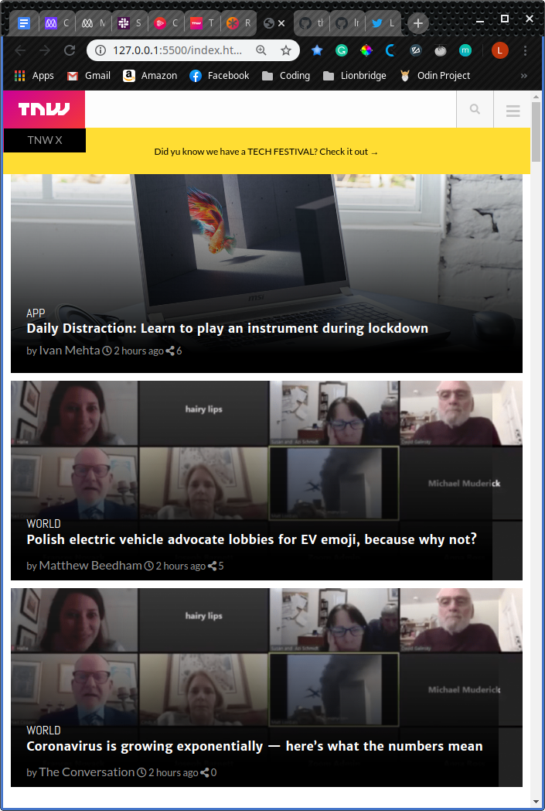

# The Next Web: Responsive design

> In this project, we worked on making a whole website responsive. We worked on the elements we had seen previously such as Grid and Flexbox, and we included Media Queries to be able to make the website look exactly as the original for different screen sizes. We also worked with background images and gradients to build a very comprehensive project that includes all the knowledge previously acquired.







The original website includes a "Sticky Navbar" that we were unable to reproduce since we did not use any Javascript; also the Navbar on the 767px breakpoint, which is fixed, has a black piece that disappears on a scroll; again, we were unable to do that but we did make it fix, it is just that the rectangle will not go away.

## Live version

[Live Version](https://rawcdn.githack.com/lmaldonadoch/the-next-web-clone/10e7dd72434473f465c2af74c3fb0a0abe567327/index.html)

## Built With

- HTML
- CSS
- Google fonts
- Font Awesome

## Getting Started

To get a local copy of the repository please run the following commands on your terminal:

```
$ cd <folder>
```

```
$ git clone git@github.com:lmaldonadoch/the-next-web-clone.git
```

## Authors

👤 **Jocyline Magero**

- Github: [@githubhandle](https://github.com/Jmagero)
- Twitter: [@twitterhandle](https://twitter.com/twitterhandle)
- Linkedin: [linkedin](https://linkedin.com/linkedinhandle)

👤 **Luis Angel Maldonado**

- Github: [@lmaldonadoch](https://github.com/lmaldonadoch)
- Twitter: [@LuisAngelMCh](https://twitter.com/LuisAngelMCh)
- Linkedin: [linkedin](https://www.linkedin.com/in/luis-angel-maldonado-5b503a1a3/)

## 🤝 Contributing

Contributions, issues and feature requests are welcome!

Feel free to check the [issues page](https://github.com/Jmagero/smashing-magazine/issues).

## Show your support

Give a ⭐️ if you like this project!

## Acknowledgments

- Project originally taken from The Odin Project
- Project inspired by Microverse Program
